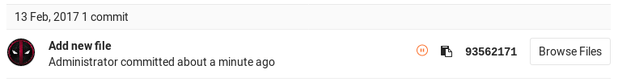
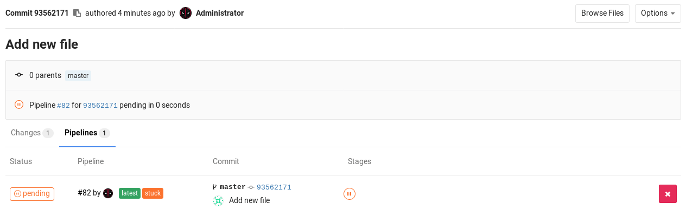
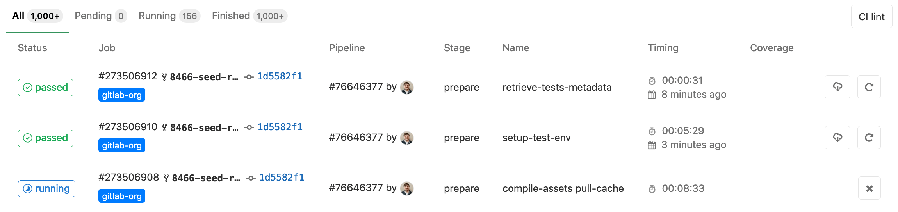

<h1 align="center">
  React Native Continuous Integration with GitLab CI, Fastlane
</h1>

<h3 align="center">
  
  </a>
</h3>

# Quick start

If you have ever worked on a project together with other people, perhaps you’ve had a situation in which you pulled some changes from a git repository and it turned out that something stopped working or the project stopped compiling. Continuous integration helps to avoid such problems. Automatic builds and test execution after each commit are also useful when you are the only person working on a given project. With continuous integration, you can notice problems faster and fix them as soon as they appear.

###### Machine environments

- [Homebrew](https://docs.brew.sh/Installation)

  ```shell
  /bin/bash -c "$(curl -fsSL https://raw.githubusercontent.com/Homebrew/install/master/install.sh)"
  ```

- [NodeJS](https://nodejs.org/en/)

* [Ruby](https://stackify.com/install-ruby-on-your-mac-everything-you-need-to-get-going/)

  ```shell
  brew install ruby
  ```

* [Bundler](https://bundler.io/doc/troubleshooting.html)

  ```shell
  sudo gem install bundler
  ```

* [Xcode](https://apps.apple.com/vn/app/xcode/id497799835)

  Install the latest Xcode command line tools:

  ```shell
  xcode-select --install
  ```

  Fix Missing Headers Compiling on macOS Mojave:

  ```shell
  open /Library/Developer/CommandLineTools/Packages/macOS_SDK_headers_for_macOS_10.14.pkg
  ```

* [Android SDK](https://gist.github.com/patrickhammond/4ddbe49a67e5eb1b9c03)

  ```shell
  brew cask install android-sdk
  ```

* [Fastlane](https://docs.fastlane.tools/getting-started/ios/setup/)

  ```shell
  brew install fastlane
  ```

* [Firebase CLI](https://firebase.google.com/docs/cli#mac-linux-npm)

  ```shell
  npm install -g firebase-tools
  ```

###### Prerequisites:

- Knowledge of iOS and Android build process
- Knowledge of iOS and Android code signing process
- Basic understanding of Fastlane
- Install Fastlane following their [recommended setup](https://docs.fastlane.tools/getting-started/ios/setup/)

###### References

- https://medium.com/@phanquanghoang/using-gitlab-ci-cd-fastlane-for-ios-project-part-1-5e7db82a3566
- https://medium.com/@phanquanghoang/https-medium-com-phanquanghoang-using-gitlab-ci-cd-fastlane-for-ios-project-part-2-f2c55bf6305e
- https://medium.com/@phanquanghoang/using-gitlab-ci-cd-fastlane-for-ios-project-part-3-f710b618da4a
- https://medium.com/@ryanisnhp/firebase-app-distribution-and-fastlane-5303c17b4395
- https://medium.com/@clementozemoya/automated-android-deployments-with-fastlane-and-firebase-app-distribution-b1d1905a4fe6
- https://medium.com/@pac_pac/how-to-auto-deploy-a-mobile-application-on-the-stores-with-gitlab-and-fastlane-608e44be3aac
- https://dev.to/matt_catalfamo/how-to-build-and-manually-sign-an-ios-app-with-fastlane-2256
- https://www.thejeremywhite.com/blog/2015/10/05/xcode-gitlab-ci-setup.html
- https://about.gitlab.com/blog/2016/03/10/setting-up-gitlab-ci-for-ios-projects/
- https://docs.gitlab.com/runner/
- https://github.com/osamaq/reactnative-fastlane-appcenter
- https://shift.infinite.red/simple-react-native-android-releases-319dc5e29605

# 1. What is CI/CD?


**CI/CD** generally refers to the combined practices of [continuous integration](https://en.wikipedia.org/wiki/Continuous_integration) and [continuous delivery](https://en.wikipedia.org/wiki/Continuous_delivery).

Testing is an essential part of the development process. Developers merge their changes back to the main branch as often as possible. The developer's changes are validated by creating a build and running some tests(Automation test). This entire process is what we call **Continuous Integration (CI)**.

**Continuous delivery(CD)** is an extension of continuous integration to make sure that you can release new changes to your customers quickly in a sustainable way. This means, besides of having automated your testing, you also have automated your release process.


# 2. Fastlane:

_Fastlane_ is a tool for iOS and Android developers to automate tedious tasks like generating screenshots, dealing with provisioning profiles, and releasing your application.

## 2.1 Getting Started:

### 2.1.1 [Setup Fastlane](https://docs.fastlane.tools/getting-started/ios/setup/):

The tool fastlane is a collection of _Ruby scripts_, so you must have the correct version of Ruby installed. Chances are that your OS comes with _Ruby 2.0_ by default, but you can confirm whether this is the case by opening Terminal and entering:

```bash
ruby -v
```

If it’s not installed, the easiest way to do so is via [_Homebrew_](http://brew.sh/) a package manager for macOS.

```bash
/usr/bin/ruby -e \
  "$(curl -fsSL https://raw.githubusercontent.com/Homebrew/install/master/install)"
```

Then, install Ruby using:

```bash
brew update && brew install ruby
```

You’ll also need _Xcode Command Line Tools (CLT)_. To ensure that they’re installed, enter into Terminal:

```bash
xcode-select --install
```

Now you’re ready to install Fastlane! Enter the following command to do so:

```bash
brew install fastlane
```

Navigate your terminal to your ios directory or android directory and run:

```bash
fastlane init
```

_Fastlane_ will automatically detect your project, and ask for any missing information.

> _Notes_: If you get a “permission denied” error, prefix this command with `sudo`.

###### [**IOS setup:**](https://docs.fastlane.tools/getting-started/ios/setup/)

After some output, Fastlane will ask: "What would you like to use fastlane for?"


You should config the Fastlane file by yourself. Input **4** and tap **Enter**.

Back to the project folder, you’ll see a few new things:

- **Gemfile**: which includes the Fastlane gem as a project dependency
- **Appfile**: stores the app identifier, your Apple ID and any other identifying information that Fastlane needs to set up your app.
- **Fastfile**: manages the _lanes_ you’ll create to invoke fastlane actions.


###### [**Android setup:**](https://docs.fastlane.tools/getting-started/android/setup/)

You'll be asked to confirm that you're ready to begin, and then for a few pieces of information. To get started quickly:

1. Provide the package name for your application when asked (e.g. io.fabric.yourapp)
2. Press enter when asked for the path to your json secret file
3. Answer 'n' when asked if you plan on uploading info to Google Play via fastlane (we can set this up later)


That's it! _Fastlane_ will automatically generate a configuration for you based on the information provided.

You can see the newly created `./fastlane` directory, with the following files:

- **Gemfile**: This will clearly define the used _Fastlane_ version, and its dependencies, and will also speed up using _fastlane_.
- **Appfile**: which defines configuration information that is global to your app
- **Fastfile**: which defines the "lanes" that drive the behavior of _fastlane_


### 2.1.2 Setup environment variables:

_Fastlane_ requires some environment variables set up to run correctly. In particular, having your locale not set to a UTF-8 locale will cause issues with building and uploading your build. In your shell profile add the following lines:

```bash
export LC_ALL=en_US.UTF-8
export LANG=en_US.UTF-8
```

## 2.2 [Configuration Fastlane iOS:](https://docs.fastlane.tools/getting-started/ios/setup/)

### 2.2.1 Appfile

```ruby
# app_identifier("[[APP_IDENTIFIER]]") # The bundle identifier of your app
# apple_id("[[APPLE_ID]]") # Your Apple email address

# For more information about the Appfile, see:
#     https://docs.fastlane.tools/advanced/#appfile
```

Remove the **#** at the beginning of the line to enable the options

In case your account has multiple teams, add the following lines:

```ruby
itc_team_id("123456789") # App Store Connect Team ID
team_id("XXXXXXXXXX") # Developer Portal Team ID
```

### 2.2.2 Fastfile - Lane configuration

Open **Fastfile**, you will see something like this:

```ruby
default_platform(:ios)

platform :ios do
  desc "Description of what the lane does"                    # 1
  lane :custom_lane do                                        # 2
    # add actions here: https://docs.fastlane.tools/actions
  end
end
```

Here’s what this code does:

1. Provides a description for the **lane**. A lane is a workflow of sequential tasks.
2. Provides the **lane name** and the **actions**(tasks) of it.

To get the most up-to-date information from the command line on your current version you can also run:

```bash
fastlane actions # list all available fastlane actions
fastlane action [action_name] # more information for a specific action
```

Or you can refer in [available actions](https://docs.fastlane.tools/actions/)

For more action, check out the [fastlane plugins](https://docs.fastlane.tools/plugins/available-plugins/) page. If you want to create your own action, check out the [local actions](https://docs.fastlane.tools/create-action/#local-actions) page.

### 2.2.3 Build your app

_Fastlane_ takes care of building your app using an **action** called [_build_app_](https://docs.fastlane.tools/actions/build_app/) (alias for **_build_ios_app_**, or **_gym_**), just add the following to your **Fastfile**:

```bash
gym(scheme: "YourScheme", export_method: "ad-hoc")
```

Additionally you can specify more options for building your app, for example:

```bash
gym(scheme: "YourScheme", export_method: "app-store")
```

For example, you will have below config for build scheme _FastlanePlayground_ and export as _ad-hoc_ method

```bash
default_platform(:ios)

platform :ios do
  desc "Archive build Ad Hoc"
  lane :gymAppAdHoc do
    gym(scheme: "YourScheme", export_method: "ad-hoc")
  end
end
```

And then, in **Terminal**, run:

```bash
fastlane gymAppAdHoc
```

If everything works, you should have a `FastlanePlayground.ipa` file in the current directory. If you see any codesigning error, don't worry, you will go to the next part.

### 2.2.4 Code Signing (Manually)

Chances are that something went wrong because of code signing at the previous step. [Code Signing Guide](https://docs.fastlane.tools/codesigning/getting-started/) will help you setting up the right code signing approach for your project.

###### Assumptions:

- You are building your app on a macOS image that doesn't have your signing certificates or provisioning profiles installed.
- You have password encrypted signing certificate downloaded to the directory on your build machine
- You have a mobile provisioning profile downloaded to a directory on your build machine
- Automatic code signing is disabled in your Xcode project

For the record, I would recommend if you have a simple iOS project that you use [Fastlane match](https://docs.fastlane.tools/actions/match/) and Xcode automatic code signing. But sometimes in the real world there are restrictions and external reasons to have to do manual code signing, so we will go through the process of building and signing manually. Here is the process.

Now we will use [import_certificate](https://docs.fastlane.tools/actions/import_certificate/) for codesigning. You can always manually create and manage your certificates and provisioning profiles using the Apple Developer Portal. Make sure to store the private key (`.p12`) of your certificates in a safe place, as they can't be restored if you lose them.

You have to download the certificate (`.cer`) and provisioning profile (`.mobileprovision`) from the Apple Developer Portal. Then, you should store it in your iOS's project like here:


Then add the following to your **Fastfile**:

```bash
desc "install Cer And Provisioning"
  lane :installCerAndProvisioning do
    import_certificate(
      keychain_name: "login",
      certificate_path: "certs/dist.p12",
      certificate_password: "yourPasswordCerts",
      keychain_password: "yourPasswordCerts"
    )
    install_provisioning_profile(path: "certs/adhoc.mobileprovision")
  end
```

Now that the hard part is over we can call the _installCerAndProvisioning_ function in the build lane before we build the app. The build lane will now look like this:

```bash
desc "Archive build Ad Hoc"
  lane :gymAppAdHoc do
    disable_automatic_code_signing
    update_project_provisioning(profile: "certs/adhoc.mobileprovision", code_signing_identity: "Apple Distribution: Team Name (ABCDU8RR8X)")
    gym(scheme: "YourScheme", export_method: "ad-hoc")
  end
```

Here’s what this code does:

1. Disable Automatically Code Signing, so you can use the provisioning profile
2. Set provisioning profile to build ad hoc
3. Build scheme "YourScheme" with method "ad-hoc"

You can read more here [update_project_provisioning](https://docs.fastlane.tools/actions/update_project_provisioning/)

### 2.2.5 [Firebase App Distribution](https://firebase.google.com/docs/app-distribution)

After building your app, it's ready to be uploaded to a beta testing service of your choice. The beauty of **Fastlane** is that you can easily switch beta provider, or even upload to multiple at once, without any extra work.

[Firebase App Distribution](https://github.com/fastlane-community/fastlane-plugin-firebase_app_distribution) makes distributing your apps to trusted testers painless. By getting your apps onto testers' devices quickly, you can get feedback early and often. To learn more about Firebase App Distribution, go [here](https://firebase.google.com/docs/app-distribution).

Because [Firebase App Distribution](https://github.com/fastlane-community/fastlane-plugin-firebase_app_distribution) is not a part of Fastlane, so you need to install it as a [_Plugins_](https://docs.fastlane.tools/plugins/using-plugins/). Run this command:

```bash
fastlane add_plugin firebase_app_distribution
```

Check that if in your Pluginfile like this


Next, install **Firebase CLI** by running this in your terminal

```shell
curl -sL firebase.tools | bash
```

Sign in your account to authorize Firebase by running

```shell
firebase login:ci
```

and you can log out anytime by running with the following command line

```shell
firebase logout
```


You can select Yes or No if you want to allow Firebase to collect your data. For me, I choose Yes because maybe Firebase will give us some reports about my apps

Then, your browser will open this link automatically to ask your permission


Print a new [refresh token](https://developers.google.com/identity/protocols/OAuth2). The current CLI session will not be affected. Store the output token in a secure but accessible way in your CI system. Use this token when setup in Fastlane to upload IPA to [Firebase App Distribution](https://firebase.google.com/docs/app-distribution)

Next is an important step, create a new lane in your Fastfile:

```ruby
desc "upload to Beta by FireBase"
lane :uploadFirebaseDev do
  firebase_app_distribution(
    app: "1:664452671234:ios:5df5316d004bac5bf61234",
    testers: “TESTER-EMAILS”,
    groups: “TESTER-GROUP”,
    release_notes: "Version Staging",
    firebase_cli_token: "1//1234HjkYpldZ4CgYIARAAGBASNwF-1234whOlK0VPxN63LfLpqBG98TzhJ_1234v3e0mrE9PtCmketolYa7hhInJwj13UisBdEM",
    )
end
```

So, what’s **APP-ID** here

Enter **Project settings** in firebase console


Scroll down and you’ll see your **APP-ID** here


Next is **TESTER-EMAILS,** back to your App Distribution and select the tab **Testers & Groups**


If you put tester emails in your lane already, you no need to add testers again manually in firebase console, like the image below, no need to add my testers again for each builds


There’re 3 milestones to show you who:

```shell
Invited already but not accept your invitation yet
Accepted your invitation but not install it yet
```

With **TESTER-GROUP,** please make sure that you use a correct group id (not a group name)

For example, I have a group name Worldwide Team, but in **Fastfile** I must input a **group ID**, as image below, we have _worldwide-team_


Next is **RELEASE-NOTE,** yeah, it’s like What’s new for this beta app?

### 2.2.6 [Final setup Fastlane](https://docs.fastlane.tools/advanced/lanes/)

Here final setup lane for all action above:

```shell
desc "Push a new build to Fabric and FireBase App Distribution"
  lane :uploadIPA do

    installCerAndProvisioning

    gymAppAdHoc

    uploadFirebaseDev

  end
```

Now we will call all lanes with this command:

```shell
fastlane uploadIPA
```

## 2.3 [Configuration Fastlane Android:](https://docs.fastlane.tools/getting-started/android/setup/)

### 2.3.1 Appfile

```ruby
json_key_file("path/to/you/json/key/file") # Path to the json secret file - Follow https://docs.fastlane.tools/actions/supply/#setup to get one
package_name("com.example.app") # e.g. com.krausefx.app
```

### 2.3.2 Fastfile - Lane configuration

Open **Fastfile**, you will see something like this:

```ruby
default_platform(:android)

platform :android do
  desc "Description of what the lane does"                    # 1
  lane :custom_lane do                                        # 2
    # add actions here: https://docs.fastlane.tools/actions
  end
end
```

Here’s what this code does:

1. Provides a description for the **lane**. A lane is a workflow of sequential tasks.
2. Provides the **lane name** and the **actions**(tasks) of it.

To get the most up-to-date information from the command line on your current version you can also run:

```bash
fastlane actions # list all available fastlane actions
fastlane action [action_name] # more information for a specific action
```

Or you can refer in [available actions](https://docs.fastlane.tools/actions/)

For more action, check out the [fastlane plugins](https://docs.fastlane.tools/plugins/available-plugins/) page. If you want to create your own action, check out the [local actions](https://docs.fastlane.tools/create-action/#local-actions) page.

### 2.3.3 Signing

Navigate to JDK binary. Find the binary with:

```bash
/usr/libexec/java_home
```

Generate keystore. Rename the key and alias.

```bash
sudo keytool -genkey -v -keystore my-release-key.keystore -alias my-key-alias -keyalg RSA -keysize 2048 -validity 10000
```

Move the key to your `android/app` directory.

```bash
sudo mv my-release-key.keystore [...path to YourAppName/android/app]
```

Create gradle variables by adding the following to `android/gradle.properties`:

```bash
MYAPP_RELEASE_STORE_FILE=my-release-key.keystore
MYAPP_RELEASE_KEY_ALIAS=my-key-alias
MYAPP_RELEASE_STORE_PASSWORD=*****
MYAPP_RELEASE_KEY_PASSWORD=*****
```

You can change the names.

Edit `android/app/build.gradle` and add the signing config and build variant:

```ruby
...
android {
    ...
    defaultConfig { ... }
    signingConfigs {
        release {
            if (project.hasProperty('MYAPP_RELEASE_STORE_FILE')) {
                storeFile file(MYAPP_RELEASE_STORE_FILE)
                storePassword MYAPP_RELEASE_STORE_PASSWORD
                keyAlias MYAPP_RELEASE_KEY_ALIAS
                keyPassword MYAPP_RELEASE_KEY_PASSWORD
            }
        }
    }
    buildTypes {
        release {
            ...
            signingConfig signingConfigs.release
        }
    }
}
...
```

Change the variable names according to the previous step. Done.

### 2.3.4 Build your app

_Fastlane_ takes care of building your app using an **action** called [_build_app_](http://docs.fastlane.tools/actions/build_android_app/#build_android_app) (alias for **gradle**), just add the following to your **Fastfile**:

```bash
gradle(
  task: "assemble",
  flavor: "WorldDomination",
  build_type: "Release"
)
```

You can pass multiple gradle tasks:

```bash
gradle(
  tasks: ["assembleDebug", "bundleDebug"]
)
```

For example, You can use this to automatically [sign and zipalign](https://developer.android.com/studio/publish/app-signing.html) your app:

```bash
default_platform(:ios)

platform :ios do
  desc "Archive build Ad Hoc"
  lane :buildReleaseAPK do
    gradle(
      task: "assemble",
      build_type: "Release",
      print_command: false,
      properties: {
        "android.injected.signing.store.file" => "keystore.jks",
        "android.injected.signing.store.password" => "store_password",
        "android.injected.signing.key.alias" => "key_alias",
        "android.injected.signing.key.password" => "key_password",
      }
    )
  end
end
```

And then, in **Terminal**, run:

```bash
fastlane buildReleaseAPK
```

The build type has to be consistent with the build variant in the previous step. If everything works, you should have a `app-develop-release.apk` file in the build outputs directory. 

### 2.3.5 [Firebase App Distribution](https://firebase.google.com/docs/app-distribution)

After building your app, it's ready to be uploaded to a beta testing service of your choice. The beauty of **Fastlane** is that you can easily switch beta provider, or even upload to multiple at once, without any extra work.

[Firebase App Distribution](https://github.com/fastlane-community/fastlane-plugin-firebase_app_distribution) makes distributing your apps to trusted testers painless. By getting your apps onto testers' devices quickly, you can get feedback early and often. To learn more about Firebase App Distribution, go [here](https://firebase.google.com/docs/app-distribution).

Because [Firebase App Distribution](https://github.com/fastlane-community/fastlane-plugin-firebase_app_distribution) is not a part of Fastlane, so you need to install it as a [_Plugins_](https://docs.fastlane.tools/plugins/using-plugins/). Run this command:

```bash
fastlane add_plugin firebase_app_distribution
```

Check that if in your Pluginfile like this


Next, install **Firebase CLI** by running this in your terminal

```shell
curl -sL firebase.tools | bash
```

Sign in your account to authorize Firebase by running

```shell
firebase login:ci
```

and you can log out anytime by running with the following command line

```shell
firebase logout
```


You can select Yes or No if you want to allow Firebase to collect your data. For me, I choose Yes because maybe Firebase will give us some reports about my apps

Then, your browser will open this link automatically to ask your permission


Print a new [refresh token](https://developers.google.com/identity/protocols/OAuth2). The current CLI session will not be affected. Store the output token in a secure but accessible way in your CI system. Use this token when setup in Fastlane to upload IPA to [Firebase App Distribution](https://firebase.google.com/docs/app-distribution)

Next is an important step, create a new lane in your Fastfile:

```ruby
desc "upload to Beta by FireBase"
	lane :uploadFirebaseDev do
    firebase_app_distribution(
      app: "1:123452671234:android:1234e227e57f2fff61234",
      testers: “TESTER-EMAILS”,
      groups: “TESTER-GROUP”,
      release_notes: "Version Staging",
      apk_path: './app/build/outputs/apk/develop/release/app-develop-release.apk',
      firebase_cli_token: "1//1234HjkYpldZ4CgYIARAAGBA1234-1234hOlK0VPxN63LfLpqBG98TzhJ_1234bv3e0mrE9PtCmketolYa7hhInJwj13UisBdEM",
    )
end
```

So, what’s **APP-ID** here

Enter **Project settings** in firebase console


Scroll down and you’ll see your **APP-ID** here


Next is **TESTER-EMAILS,** back to your App Distribution and select the tab **Testers & Groups**


If you put tester emails in your lane already, you no need to add testers again manually in firebase console, like the image below, no need to add my testers again for each builds


There’re 3 milestones to show you who:

```shell
Invited already but not accept your invitation yet
Accepted your invitation but not install it yet
```

With **TESTER-GROUP,** please make sure that you use a correct group id (not a group name)

For example, I have a group name Worldwide Team, but in **Fastfile** I must input a **group ID**, as image below, we have _worldwide-team_


Next is **RELEASE-NOTE,** yeah, it’s like What’s new for this beta app?

### 2.3.6 [Final setup Fastlane](https://docs.fastlane.tools/advanced/lanes/)

Here final setup lane for all action above:

```shell
desc "Push a new build to Fabric and FireBase App Distribution"
  lane :uploadAPK do

    buildReleaseAPK

    uploadFirebaseDev

  end
```

Now we will call all lanes with this command:

```shell
fastlane uploadAPK
```

# 3. [GitLab Runner](https://docs.gitlab.com/runner/)

GitLab Runner is the open source project that is used to run your jobs and send the results back to GitLab. It is used in conjunction with [GitLab CI/CD](https://about.gitlab.com/stages-devops-lifecycle/continuous-integration/), the open-source continuous integration service included with GitLab that coordinates the jobs.

It's beyond the scope of this tutorial to go into details on best practices, workflows, and advantages/disadvantages of CI. In short, however, here's what happens when you enable it for your project:

1. You make changes to your copy of the codebase and push a commit to GitLab.
2. GitLab recognizes that the codebase has changed.
3. GitLab triggers a build with the GitLab Runner you set up on your Mac for the project.
4. The GitLab Runner runs through the build and test process you specified in `.gitlab-ci.yml`.
5. The GitLab Runner reports its results back to GitLab.
6. GitLab shows you the results of the build.

## 3.1 [Setup GitLab Runner](https://gitlab.com/gitlab-org/gitlab-runner/blob/master/docs/install/osx.md)

GitLab Runner can be installed and updated on macOS.

### Installing

NOTE: **Note:** For documentation on GitLab Runner 9 and earlier, [visit this documentation]().

1. Download the binary for your system:

   ```shell
   sudo curl --output /usr/local/bin/gitlab-runner https://gitlab-runner-downloads.s3.amazonaws.com/latest/binaries/gitlab-runner-darwin-amd64
   ```

   You can download a binary for every available version as described in [Bleeding Edge - download any other tagged release]().

2. Give it permissions to execute:

   ```shell
   sudo chmod +x /usr/local/bin/gitlab-runner
   ```

**The rest of commands execute as the user who will run the Runner.**

1. [Register the Runner]()

   To register a Runner under macOS:

   Run the following command:

   ```shell
   gitlab-runner register
   ```

   Enter your GitLab instance URL:

   ```shell
   Please enter the gitlab-ci coordinator URL (e.g. https://gitlab.com )
   https://gitlab.com
   ```

   Enter the token you obtained to register the Runner, You can get your token in **Gitlab Setting** -> **CI/CD** -> **Runner**:

   ```shell
   Please enter the gitlab-ci token for this runner
   xxx
   ```

   

   Enter a description for the Runner, you can change this later in GitLab’s UI:

   ```shell
   Please enter the gitlab-ci description for this runner
   [hostname] my-runner
   ```

   Enter the [tags associated with the Runner](https://docs.gitlab.com/ee/ci/runners/#using-tags), you can change this later in GitLab’s UI:

   ```shell
   Please enter the gitlab-ci tags for this runner (comma separated):
   my-tag,another-tag
   ```

   Enter the [Runner executor](https://docs.gitlab.com/runner/executors/README.html):

   ```shell
   Please enter the executor: ssh, docker+machine, docker-ssh+machine, kubernetes, docker, parallels, virtualbox, docker-ssh, shell:
   shell
   ```

   As we can see, the registration command is specifying the `shell` executor. Let’s see what is the final configuration `~/.gitlab-runner/config.toml` content:

   ```yaml
   concurrent = 1 #limits how many jobs globally can be run concurrently. The most upper limit of jobs using all defined runners. 0 does not mean unlimited
   check_interval = 0 #defines the interval length, in seconds, between new jobs check. The default value is 3; if set to 0 or lower, the default value will be used.
   
   [session_server]
     session_timeout = 1800 #How long in seconds the session can stay active after the job completes (which will block the job from finishing), defaults to 1800 (30 minutes).
   
   [[runners]]
     name = "test-runner" #The name of the image to be run as a service
     url = "https://gitlab.com" #GitLab URL
     token = "__REDACTED__" #The Runner’s special token (not to be confused with the registration token)
     executor = "shell" #run build locally, default
     [runners.cache]
       [runners.cache.s3]
       [runners.cache.gcs]
   ```

   You can see more config [here](https://docs.gitlab.com/runner/configuration/advanced-configuration.html#the-global-section)

2. Install the Runner as service and start it:

   ```shell
   cd ~
   gitlab-runner install
   gitlab-runner start
   ```

Runner is installed and will be run after a system reboot.

You can verify this by running

```shell
$ gitlab-ci-multi-runner verify
WARNING: Running in user-mode.
WARNING: The user-mode requires you to manually start builds processing:
WARNING: $ gitlab-runner run
WARNING: Use sudo for system-mode:
WARNING: $ sudo gitlab-runner...

Veryfing runner... is alive                         runner=25c780b3
```

### Manual update

1. Stop the service:

   ```shell
   gitlab-runner stop
   ```

2. Download the binary to replace the Runner's executable:

   ```shell
   sudo curl -o /usr/local/bin/gitlab-runner https://gitlab-runner-downloads.s3.amazonaws.com/latest/binaries/gitlab-runner-darwin-amd64
   ```

   You can download a binary for every available version as described in [Bleeding Edge - download any other tagged release]().

3. Give it permissions to execute:

   ```shell
   sudo chmod +x /usr/local/bin/gitlab-runner
   ```

4. Start the service:

   ```bash
   gitlab-runner start
   ```

Make sure that you read the [FAQ]() section which describes some of the most common problems with GitLab Runner. You can see more commands [here](https://docs.gitlab.com/runner/commands/)

## Upgrade the service file

In order to upgrade the `LaunchAgent` configuration, you need to uninstall and install the service:

```bash
gitlab-runner uninstall
gitlab-runner install
gitlab-runner start
```

## 3.2 [Configuration GitLab Runner](https://docs.gitlab.com/ee/ci/quick_start/#creating-a-gitlab-ciyml-file)

Before you create `.gitlab-ci.yml` let’s first explain in brief what this is all about.

### What is `.gitlab-ci.yml`

The `.gitlab-ci.yml` file is where you configure what CI does with your project. It lives in the root of your repository.

On any push to your repository, GitLab will look for the `.gitlab-ci.yml` file and start jobs on _Runners_ according to the contents of the file, for that commit.

Because `.gitlab-ci.yml` is in the repository and is version controlled, old versions still build successfully, forks can easily make use of CI, branches can have different pipelines and jobs, and you have a single source of truth for CI. You can read more about the reasons why we are using `.gitlab-ci.yml` [here](https://about.gitlab.com/blog/2015/05/06/why-were-replacing-gitlab-ci-jobs-with-gitlab-ci-dot-yml/).

### Repository setup

First create a `Gemfile` in the root of your project with the following content:

```bash
source "https://rubygems.org"

gem "fastlane"
```

### Creating a simple `.gitlab-ci.yml` file to trigger Fastlane

> **Note:** `.gitlab-ci.yml` is a [YAML](https://en.wikipedia.org/wiki/YAML) file so you have to pay extra attention to indentation. Always use spaces, not tabs.

You need to create a file named `.gitlab-ci.yml` in the root directory of your repository. Below is an example of the current tutorial:

```yaml
stages: #used to define stages that can be used by jobs and is defined globally
  - deployiOS
  - deployAndroid
variables: #Set up environment values
  LC_ALL: "en_US.UTF-8"
  LANG: "en_US.UTF-8"
before_script: #Override a set of commands that are executed before job.
  - bundle install --path vendor/bundle 
  - npm i #install node_modules for RN project
deployiOS:
  dependencies: []
  stage: deployiOS
  script: #scrip when work with current state
    - cd ios/
    - pod install
    - fastlane uploadIPA
  tags: #tag registered with gitlab-runner
    - ios
  only: #defines the names of branches and tags for which the job will run
    - build-dev
deployAndroid:
  dependencies: []
  stage: deployAndroid
  script: #scrip when work with current state
    - npx jetify
    - cd android/
    - fastlane uploadAPK
  tags: #tag registered with gitlab-runner
    - android
  only: #defines the names of branches and tags for which the job will run
    - build-dev
```

This is the simplest possible configuration that will work for most React Native projects:

1. Define job `deploy` (the names are arbitrary) with commands to be executed.
2. Before every job, the commands defined by `before_script` are executed.
3. We defined which branch will run this job by only: `build-dev`

The `.gitlab-ci.yml` file defines sets of jobs with constraints of how and when they should be run. The jobs are defined as top-level elements with a name (in our case `deployiOS` and `deployAndroid`) and always have to contain the `script` keyword. Jobs are used to create jobs, which are then picked by [Runners](https://docs.gitlab.com/ee/ci/runners/README.html) and executed within the environment of the Runner.

What is important is that each job is run independently from each other.

If you want to check whether the `.gitlab-ci.yml` of your project is valid, there is a Lint tool under the page `/-/ci/lint` of your project namespace. You can also find a “CI Lint” button to go to this page under **CI/CD ➔ Pipelines** and **Pipelines ➔ Jobs** in your project.

For more information and a complete `.gitlab-ci.yml` syntax, please read [the reference documentation on `.gitlab-ci.yml`](https://docs.gitlab.com/ee/ci/yaml/README.html).

### Push `.gitlab-ci.yml` to GitLab

Once you’ve created `.gitlab-ci.yml`, you should add it to your Git repository and push it to GitLab.

```shell
git add .gitlab-ci.yml
git commit -m "Add .gitlab-ci.yml"
git push origin master
```

Now if you go to the **Pipelines** page you will see that the pipeline is pending.

**Note:** If you have a [mirrored repository where GitLab pulls from](https://docs.gitlab.com/ee/user/project/repository/repository_mirroring.html#pulling-from-a-remote-repository-starter), you may need to enable pipeline triggering in your project’s **Settings > Repository > Pull from a remote repository > Trigger pipelines for mirror updates**.

You can also go to the **Commits** page and notice the little pause icon next to the commit SHA.



Clicking on it you will be directed to the jobs page for that specific commit.



Notice that there is a pending job which is named after what we wrote in `.gitlab-ci.yml`. “stuck” indicates that there is no Runner configured yet for this job.

### Seeing the status of your pipeline and jobs

After configuring the Runner successfully, you should see the status of your last commit change from _pending_ to either _running_, _success_ or _failed_.

You can view all pipelines by going to the **Pipelines** page in your project.


Or you can view all jobs, by going to the **Pipelines ➔ Jobs** page.



By clicking on a job’s status, you will be able to see the log of that job. This is important to diagnose why a job failed or acted differently than you expected.


You are also able to view the status of any commit in the various pages in GitLab, such as **Commits** and **Merge requests**.

### Examples

Visit the [examples README](https://docs.gitlab.com/ee/ci/examples/README.html) to see a list of examples using GitLab CI with various languages.

# 4. In closing…

Hopefully, this has been helpful and has inspired you to get builds and publishing working within your GitLab project. There is some good additional [CI/CD best-practice](https://docs.fastlane.tools/best-practices/continuous-integration/) documentation for _Fastlane_ if you get stuck anywhere, and you could also consider using the `CI_BUILD_ID` (which increments each builds) to [automatically increment a version](https://docs.fastlane.tools/best-practices/continuous-integration/gitlab/#auto-incremented-build-number).

Thanks to Gitlab.com we have our completely free CI and we have learned something about the Fastlane tool. We also managed to create a mechanism for installing IPA straight from Gitlab, so we do not need to use any additional services and we have everything in one place. Of course, if we need something more advanced to publish our application, with the help of Fastlane we can easily add for example integration with Testflight. I encourage you to learn more about Fastlane and adapt the presented solution to your needs.

I hope this tutorial can be of great help to you during the software development process, save time for you and your team.
